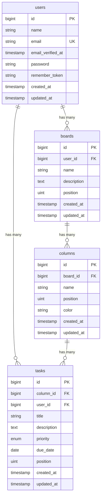

# ER図（Entity Relationship Diagram）

## 概要

本プロジェクト（カンバンボード）のデータベース構造を示すER図です。
アプリケーション固有の4テーブル（users, boards, columns, tasks）を対象としています。

## ER図

## テーブル詳細

### users

ユーザー情報を管理するテーブル。

| カラム | 型 | 制約 | 説明 |
|--------|------|------|------|
| id | bigint | PK, AUTO INCREMENT | ユーザーID |
| name | string | NOT NULL | ユーザー名 |
| email | string | NOT NULL, UNIQUE | メールアドレス |
| email_verified_at | timestamp | nullable | メール認証日時 |
| password | string | NOT NULL | ハッシュ化パスワード |
| remember_token | string | nullable | ログイン保持トークン |
| created_at | timestamp | | 作成日時 |
| updated_at | timestamp | | 更新日時 |

### boards

カンバンボードを管理するテーブル。

| カラム | 型 | 制約 | 説明 |
|--------|------|------|------|
| id | bigint | PK, AUTO INCREMENT | ボードID |
| user_id | bigint | FK → users.id, CASCADE | 所有ユーザー |
| name | string | NOT NULL | ボード名 |
| description | text | nullable | ボードの説明 |
| position | unsigned int | default: 0 | 表示順序 |
| created_at | timestamp | | 作成日時 |
| updated_at | timestamp | | 更新日時 |

### columns

ボード内のカラム（列）を管理するテーブル。

| カラム | 型 | 制約 | 説明 |
|--------|------|------|------|
| id | bigint | PK, AUTO INCREMENT | カラムID |
| board_id | bigint | FK → boards.id, CASCADE | 所属ボード |
| name | string | NOT NULL | カラム名 |
| position | unsigned int | default: 0 | 表示順序 |
| color | string(7) | default: '#6B7280' | カラムの色（HEX） |
| created_at | timestamp | | 作成日時 |
| updated_at | timestamp | | 更新日時 |

### tasks

タスク（カード）を管理するテーブル。

| カラム | 型 | 制約 | 説明 |
|--------|------|------|------|
| id | bigint | PK, AUTO INCREMENT | タスクID |
| column_id | bigint | FK → columns.id, CASCADE | 所属カラム |
| user_id | bigint | FK → users.id, CASCADE | 作成ユーザー |
| title | string | NOT NULL | タスクタイトル |
| description | text | nullable | タスクの説明 |
| priority | enum | default: 'medium' | 優先度（low / medium / high / urgent） |
| due_date | date | nullable | 期限日 |
| position | unsigned int | default: 0 | 表示順序 |
| created_at | timestamp | | 作成日時 |
| updated_at | timestamp | | 更新日時 |

## リレーションシップ

| 親テーブル | 子テーブル | 関係 | 削除時の挙動 |
|-----------|-----------|------|-------------|
| users | boards | 1対多 | CASCADE（ユーザー削除でボードも削除） |
| users | tasks | 1対多 | CASCADE（ユーザー削除でタスクも削除） |
| boards | columns | 1対多 | CASCADE（ボード削除でカラムも削除） |
| columns | tasks | 1対多 | CASCADE（カラム削除でタスクも削除） |

## 設計上の特徴

- **階層構造**: `User → Board → Column → Task` の4階層で構成
- **CASCADE削除**: 親レコードを削除すると子レコードも連鎖的に削除される
- **位置管理**: boards, columns, tasks すべてに `position` カラムを持ち、ドラッグ&ドロップによる並び替えに対応
- **タスク優先度**: `low` / `medium` / `high` / `urgent` の4段階をenum型で管理
- **カラム色**: 各カラムに16進カラーコード（7文字）を持ち、視覚的な区別が可能
